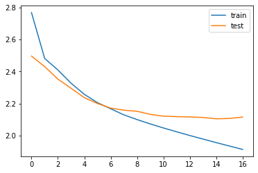

## AIFFEL Campus Online Code Peer Review Templete
- 코더 : 서승호
- 리뷰어 : 이혁희


## PRT(Peer Review Template)
- [ ]  **1. 주어진 문제를 해결하는 완성된 코드가 제출되었나요?**
    - Abstractive 모델 구성을 위한 전처리가 잘 진행되었습니다.
    ```
    drop_train = [index for index, sentence in enumerate(decoder_input_train) if len(sentence) == 1]
    drop_test = [index for index, sentence in enumerate(decoder_input_test) if len(sentence) == 1]

    print('삭제할 훈련 데이터의 개수 :', len(drop_train))
    print('삭제할 테스트 데이터의 개수 :', len(drop_test))

    encoder_input_train = [sentence for index, sentence in enumerate(encoder_input_train) if index not in drop_train]
    decoder_input_train = [sentence for index, sentence in enumerate(decoder_input_train) if index not in drop_train]
    decoder_target_train = [sentence for index, sentence in enumerate(decoder_target_train) if index not in drop_train]

    encoder_input_test = [sentence for index, sentence in enumerate(encoder_input_test) if index not in drop_test]
    decoder_input_test = [sentence for index, sentence in enumerate(decoder_input_test) if index not in drop_test]
    decoder_target_test = [sentence for index, sentence in enumerate(decoder_target_test) if index not in drop_test]

    print('훈련 데이터의 개수 :', len(encoder_input_train))
    print('훈련 레이블의 개수 :', len(decoder_input_train))
    print('테스트 데이터의 개수 :', len(encoder_input_test))
    print('테스트 레이블의 개수 :', len(decoder_input_test))

    [결과]
    삭제할 훈련 데이터의 개수 : 1151
    삭제할 테스트 데이터의 개수 : 300
    훈련 데이터의 개수 : 42509
    훈련 레이블의 개수 : 42509
    테스트 데이터의 개수 : 10615
    ```
    - 텍스트 요약모델을 성공적으로 학습하고 결과를 보여 주었습니다.
   
    학습 그래프
    ```
    plt.plot(history.history['loss'], label='train')
    plt.plot(history.history['val_loss'], label='test')
    plt.legend()
    plt.show()
    ```
    

    예측 요약문 예제
    ```
    for i in range(50, 100):
        print("원문 :", seq2text(encoder_input_test[i]))
        print("실제 요약 :", seq2summary(decoder_input_test[i]))
        print("예측 요약 :", decode_sequence(encoder_input_test[i].reshape(1, text_max_len)))
        print("\n")


    원문 : dog anything treat also treat cut easily small pieces training ingredients listed good quality ill effects giving dog beef flavor purchased time 
    실제 요약 : maybe got can but 
    예측 요약 :  great for the price


    원문 : eat brand percentage one agrees taste wonderful trouble milk butter always less problem makes one best option found 
    실제 요약 : taste of home but 
    예측 요약 :  great for the office
    ```

    - Extractive 요약을 시도한 실험은 진행 중이라고 합니다.
    
- [ ]  **2. 전체 코드에서 가장 핵심적이거나 가장 복잡하고 이해하기 어려운 부분에 작성된 
주석 또는 doc string을 보고 해당 코드가 잘 이해되었나요?**
    - 노드의 예제를 잘 이해하여 코드를 작성하였고 코드 이해가 잘 되었습니다.

- [ ]  **3. 에러가 난 부분을 디버깅하여 문제를 “해결한 기록을 남겼거나” 
”새로운 시도 또는 추가 실험을 수행”해봤나요?**
    - 어려운 코드를 잘 작성하고 싶행하였습니다.
        
- [ ]  **4. 회고를 잘 작성했나요?**
    - 회고문을 찾지 못하였습니다.

- [ ]  **5. 코드가 간결하고 효율적인가요?**
    - 노드의 예제를 잘 이해하여 코드를 작성했고 성공적으로 실행 되었습니다.
    

## 참고 링크 및 코드 개선
```
# 코드 리뷰 시 참고한 링크가 있다면 링크와 간략한 설명을 첨부합니다.
# 코드 리뷰를 통해 개선한 코드가 있다면 코드와 간략한 설명을 첨부합니다.
```
